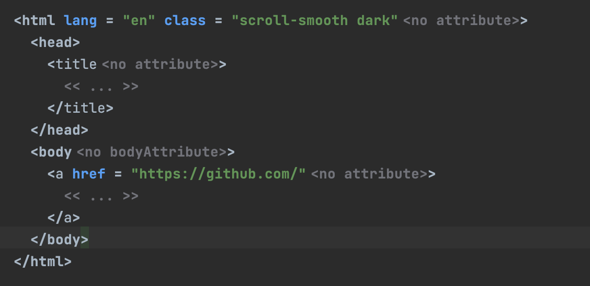
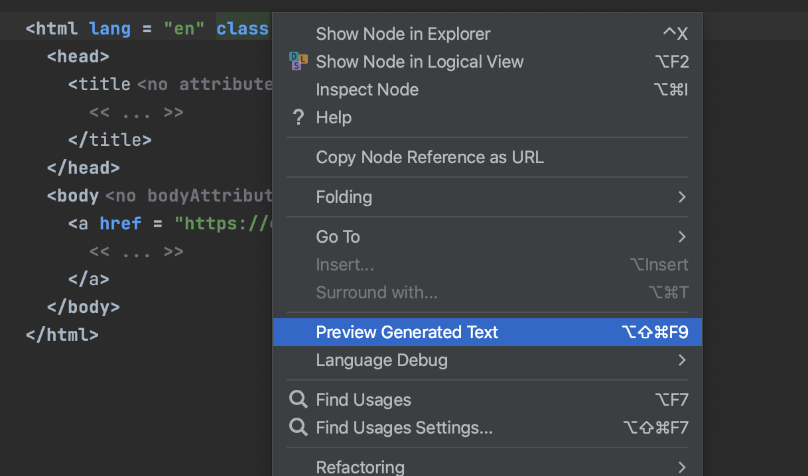

# Creating HTML with MPS
HTML prototype written with MPS. Required for automatic generation of documentation for languages written with MPS.
Clicking on "Preview Generated Text" in document in Solution generates HTML.

I have introduced the basic elements of HTML, including the <html>, <head>, and <body> tags. The <head> and <body> sections can be expanded with a wide range of additional tags. HTML attributes can be added to any element and are currently unlimited. Nested elements and multiple attributes function properly.